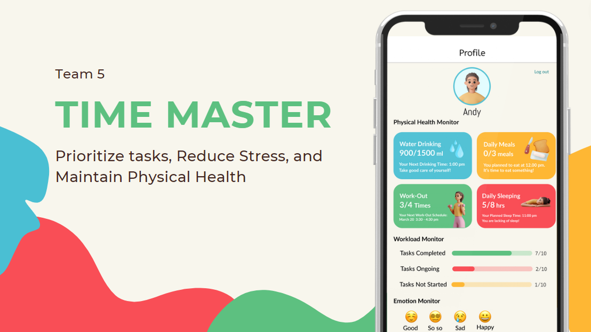

# TimeMaster

## About 
Our team is making an app that uses calendars and lists to help students prioritze their deadlines and tasks, inevitably reducing stress.

### QDS HACK 2024:
This is our teams submission for QDS Hack 2024. Below, you will find our presentation slides that got us into the final round of 8 out of 31 teams. 

### Devpost Link
https://devpost.com/software/time-master-6abmcv

### Presentation Video
https://youtu.be/TsRPZAiNx_M

### Our Presentation Slides:
https://www.canva.com/design/DAF_CX9e7F4/MQP2uv69sucheumB7wRoVw/view

## Tools Used 

* HTML 
* JavaScript
* Jquery 
* TailwindCSS 

## Inspiration 

We found inspiration to make this app, based on personal experiences. We have calendars to see our due dates for school, but we don't have something that manages our time for us. Students tend to forget to take care of themselves when they get so busy with school. That was our main goal with Time Master. We wanted this to be an app to help you manage your time, leading to less stress, and a healthier lifestyle.

